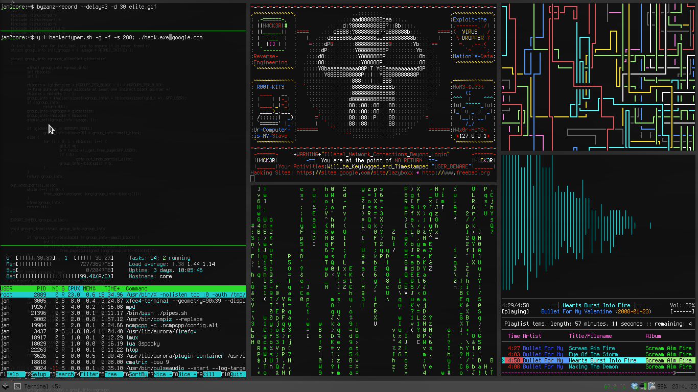

# 👋 Hello, Stranger ✨ 
## 🌟⚡ Step into My Dev World 🚀💻✨

  

# 💫 About Me:
🚀 **Currently working on:** Cloud Computing & Full-Stack Projects   🤝 **Open to collaboration on:** Open Source & Web Development Projects   💡 **Seeking guidance on:** Advanced Cloud Architectures & DevOps Practices   🌱 **Currently learning:** Docker, Kubernetes & Virtual Machines   🖥️ **Ask me about:** React.js, Laravel, Tailwind CSS, Full-Stack Development   🎨 **Fun fact:** I love crafting unique UI designs that break the usual template

## 🌐 Socials:
    

# 💻 Tech Stack:
                                                               
# 📊 GitHub Stats:
 
 

### ✍️ Random Dev Quote

### 🔝 Top Contributed Repo

---

<!-- Proudly created with GPRM ( https://gprm.itsvg.in ) -->

<!-- Proudly created with GPRM ( https://gprm.itsvg.in ) -->
